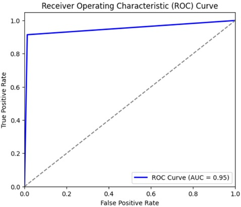

# Code Clone Detection using CodeBERT

Code Clone Detection is an AI-powered deep learning approach that leverages the transformer-based model CodeBERT to identify semantic similarity between code snippets, enabling accurate detection of functionally equivalent code even when their structure differs.

The approach analyzes pairs of code snippets and determines whether they represent the same functionality. Instead of relying only on surface-level matching, it captures contextual relationships within code to detect logically similar implementations with strong accuracy.

## ⚙️ How it Works

- Input: pair of code snippets  
- CodeBERT processes both snippets to capture context  
- Representations are compared  
- Output: clone or non-clone  

## ✨ Key Highlights

- Detects semantic similarity beyond syntax  
- Handles structurally different but logically equivalent code  
- Classifies code pairs as clone or non-clone  
- Maintains low false predictions  
- Suitable for real-world code analysis  

## 📊 Performance

- Accuracy: **95%**  
- ROC-AUC: **0.95**

## 📈 Results

  

---

## 🧩 Applications

- Code plagiarism detection  
- Software maintenance and refactoring  
- Code quality analysis  

## 🛠️ Tech Stack

Python · PyTorch · Transformers (CodeBERT) · NumPy · Pandas · Scikit-learn  

## 📂 Structure

- `src/` — implementation  
- `results/` — outputs  
- `docs/` — documentation  

